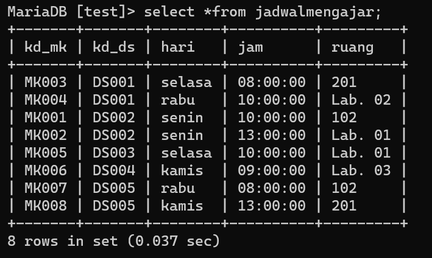

# Basis_data_praktikum_5

```
Latihan
1 Lakukan join table Mahasiswa dan Dosen
2 Lakukan join tabel Matakuliah dan Dosen
3 Lakukan join table JadwalMengajar, Dosen, dan Matakuluan
4 Lakukan join tabel KrsMahasiswa, Mahasiswa, Matakuliah, dan Dosen
```
### Tabel Mahasiswa


### Tabel Dosen


### Tabel KrsMahasiswa


### Tabel JadwalMengajar


### Tabel Matakuliah


# LATIHAN

1 Lakukan join table Mahasiswa dan Dosen)


2 Lakukan join tabel Matakuliah dan Dosen

```
Pada kode ini hasilnya tabel dosen null karena kedua tabel tidak saling ber relasi
```


3 Lakukan join table JadwalMengajar, Dosen, dan Matakuluan


4 Lakukan join tabel KrsMahasiswa, Mahasiswa, Matakuliah, dan Dosen


# LATIHAN

1. JOIN table Mahasiswa dan Dosen
```
SELECT Mahasiswa.nim, Mahasiswa.nama, Mahasiswa.jenis_kelamin, Dosen.nama AS 'Dosen' 
FROM Mahasiswa 
JOIN Dosen ON Dosen.kd_ds=Mahasiswa.kd_ds;
```


2. LEFT JOIN table Mahasiswa dan Dosen
```
SELECT Mahasiswa.nim, Mahasiswa.nama, Mahasiswa.jenis_kelamin, Dosen.nama AS 'Dosen'
FROM Mahasiswa
LEFT JOIN Dosen ON Dosen.kd_ds=Mahasiswa.kd_ds;
```


3. JOIN table JadwalMengajar, Dosen, dan Matakuliah
```
SELECT jadwalMengajar.kd_mk, matakuliah.nama AS 'Mata kuliah', matakuliah.sks, Dosen.nama AS 'Dosen Pengampu'
FROM jadwalMengajar
JOIN Dosen ON jadwalMengajar.kd_ds = Dosen.kd_ds
JOIN matakuliah ON jadwalMengajar.kd_mk = matakuliah.kd_mk;
```


4. JOIN table JadwalMengajar, Dosen, dan Matakuliah
```
SELECT jadwalMengajar.kd_mk, matakuliah.nama AS 'Mata kuliah', matakuliah.sks, Dosen.nama AS 'Dosen Pengampu', jadwalMengajar.hari, jadwalMengajar.jam, jadwalMengajar.ruang
FROM jadwalMengajar
JOIN Dosen ON jadwalMengajar.kd_ds = Dosen.kd_ds
JOIN matakuliah ON jadwalMengajar.kd_mk = matakuliah.kd_mk;

